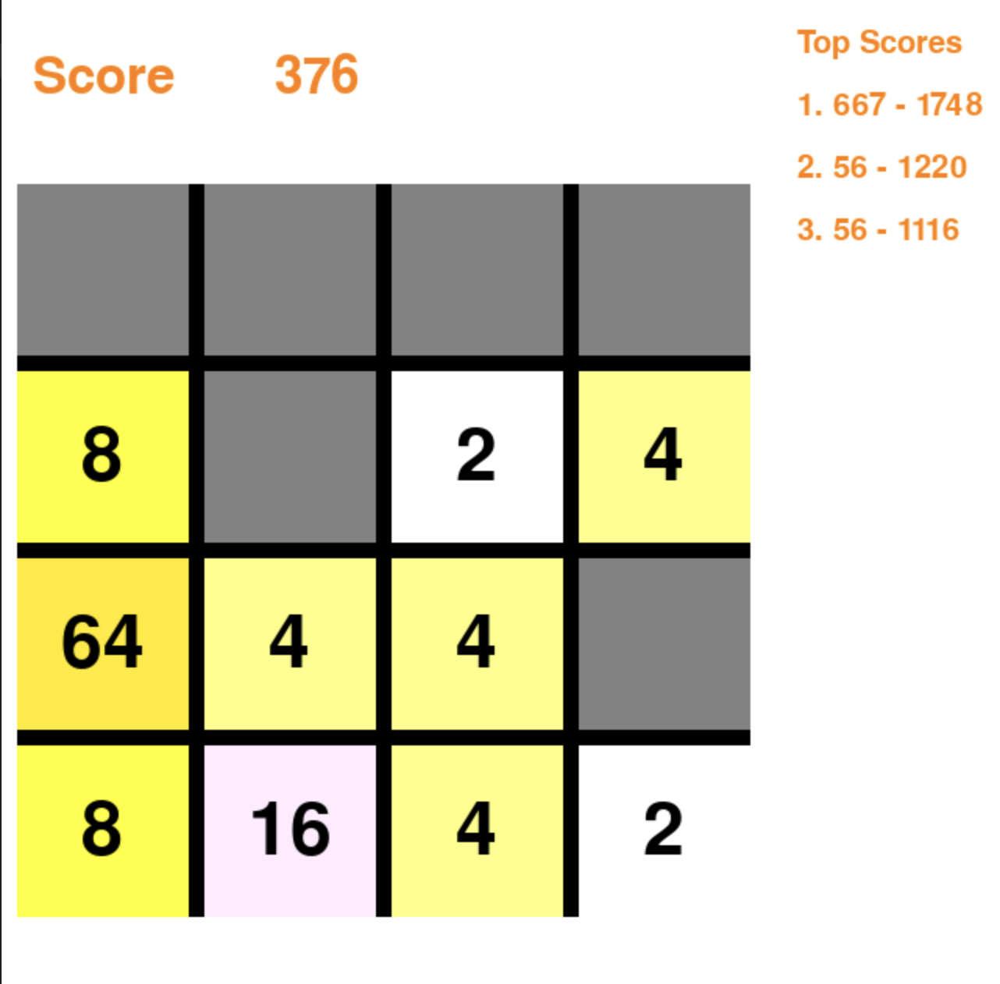
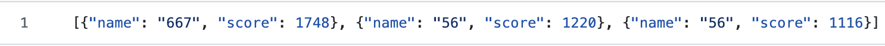

# 2048 Game - Python & Pygame Implementation

## Introduction

This is a Python implementation of the classic 2048 sliding puzzle game. The game includes features such as real-time tile merging, high score tracking, and a user-friendly interface. The project uses the `pygame` library for the graphical interface and `json` for storing high scores.

---

## Features

- **Interactive Gameplay:** Use arrow keys to slide and merge tiles.
- **Dynamic Scoring:** Tracks the player's score in real time.
- **High Score System:** Saves and displays the top 3 scores across sessions.
- **Customizable Interface:** Dynamic tile colors and grid design.



---

## How It Works

### 1. High Score Loading and Saving
The game loads and saves high scores using a JSON file. This ensures persistence across multiple game sessions.

```python
# Load high scores from a file
def load_high_scores(filename="high_scores.json"):
    try:
        with open(filename, "r") as file:
            return json.load(file)
    except FileNotFoundError:
        return [{"name": "None", "score": 0} for _ in range(3)]
    except json.JSONDecodeError:
        print("Error: high_scores.json is corrupted. Creating a new file.")
        return [{"name": "None", "score": 0} for _ in range(3)]

# Save high scores to a file
def save_high_scores(high_scores, filename="high_scores.json"):
    try:
        with open(filename, "w") as file:
            json.dump(high_scores, file)
    except IOError:
        print("Error: Failed to save the high scores.")
```



---

### 2. Game Mechanics

#### Tile Movement
Tiles slide and merge in the direction of the player's input. The `move_left` function below demonstrates how tiles shift left and merge.

```python
def move_left(mas):
    delta = 0  # Score gained in this move
    for row in mas:
        while 0 in row:
            row.remove(0)  # Remove all zeros
        while len(row) != 4:
            row.append(0)  # Add zeros to the right
    for i in range(4):  # Merge adjacent tiles
        for j in range(3):
            if mas[i][j] == mas[i][j+1] and mas[i][j] != 0:
                mas[i][j] *= 2
                delta += mas[i][j]
                mas[i].pop(j+1)
                mas[i].append(0)
    return mas, delta
```


#### Random Tile Placement
After each move, a new tile (2 or 4) is added to the grid at a random empty position.

```python
def insert_2_or_4(mas, x, y):
    if random.random() <= 0.75:  # 75% chance for a 2
        mas[x][y] = 2
    else:  # 25% chance for a 4
        mas[x][y] = 4
    return mas
```


---

## Game Interface

The interface is designed using `pygame` with distinct areas for the grid, score display, and high scores.

```python
# Draw game interface
def draw_interface(score, delta=0, high_scores=[]):
    screen.fill(WHITE)
    pygame.draw.rect(screen, WHITE, TITLE_REC)

    font_score = pygame.font.SysFont("simsun", 48)
    text_score = font_score.render("Score", True, COLOR_TEXT)
    text_score_value = font_score.render(f"{score}", True, COLOR_TEXT)
    screen.blit(text_score, (20, 35))
    screen.blit(text_score_value, (175, 35))
```


---

## Installation and Setup

1. Clone the repository.
2. Install dependencies using `pip install pygame`.
3. Run the game using `python main.py`.


---

## Future Improvements

- Add animations for smoother tile movements.
- Introduce additional game modes and themes.
- Implement advanced high score analytics.

---

## Acknowledgments

Special thanks to the `pygame` community and online resources for their support.


